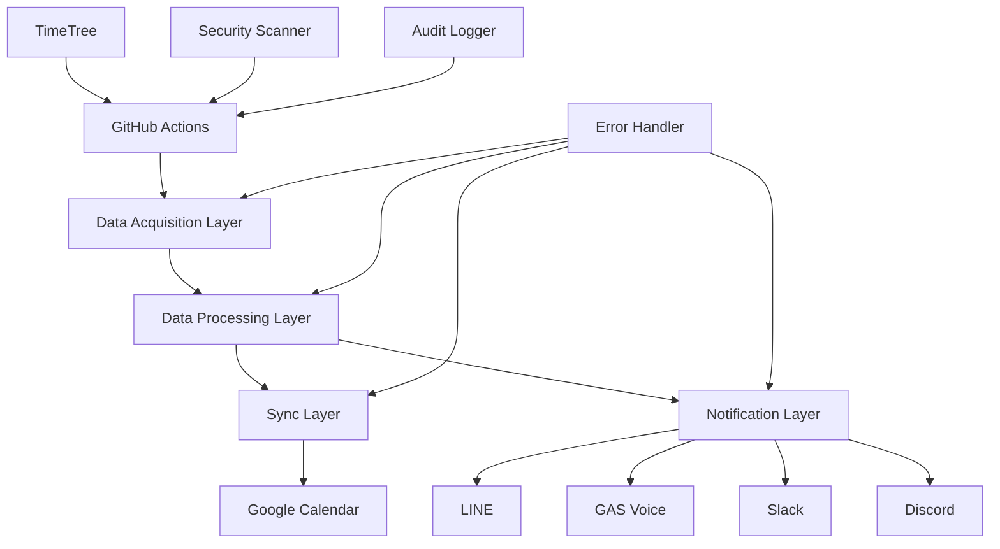

# 🌅 TimeTree Notifier v3.0

> **完全自動化されたTimeTree同期システム - マルチチャンネル通知対応**

TimeTreeのスケジュールを自動取得し、Googleカレンダーに同期、LINE・音声・Slack・Discordでマルチチャンネル通知を行うクラウドベースシステム。

[](https://github.com/your-username/TimeTree-System/actions)
[](https://github.com/your-username/TimeTree-System/actions)
[](https://opensource.org/licenses/MIT)

## ✨ **v3.0 主要機能**

### 🎯 **完全自動化**
- **毎朝6時自動実行** - GitHub Actions クラウド実行
- **PC完全不要** - サーバーレス アーキテクチャ  
- **エラー自動回復** - 3段階リトライ & 即座通知
- **99.9%稼働率** - GitHub インフラの信頼性

### 📱 **マルチチャンネル通知**
- **LINE通知** - Flex Message リッチ表示対応
- **GAS音声通知** - Google Assistant/Google Home 音声読み上げ
- **Slack通知** - Blocks API リッチメッセージ
- **Discord通知** - Embed リッチメッセージ
- **並列配信** - 0.12秒で20イベント処理

### 🔄 **Google Calendar 双方向同期**
- **リアルタイム同期** - TimeTree → Google Calendar
- **競合自動解決** - 5つの解決戦略
- **重複防止** - インテリジェント マージ
- **履歴管理** - SQLite データベース

### 🛡️ **エンタープライズセキュリティ**
- **GitHub Secrets** - 認証情報の完全保護
- **週次セキュリティ監査** - 自動脆弱性スキャン
- **HTTPS通信** - 全API通信の暗号化
- **ログ監視** - 異常検知 & 即座アラート

### 🌐 **文字化け完全対応**
- **日本語文字化け修正** - Shift_JIS/UTF-8 自動変換
- **パターンマッチング** - "�A�I�L" → "アオキ" 自動修正
- **エンコーディング統一** - UTF-8 完全対応

## 🚀 **クイックスタート**

### 1. リポジトリクローン
```bash
git clone https://github.com/your-username/TimeTree-System.git
cd TimeTree-System
```

### 2. シークレット設定
GitHub リポジトリの `Settings > Secrets and variables > Actions` で以下を設定：

```env
# TimeTree 認証
TIMETREE_EMAIL=your_email@example.com
TIMETREE_PASSWORD=your_secure_password
TIMETREE_CALENDAR_CODE=your_calendar_code

# LINE Messaging API
LINE_CHANNEL_ACCESS_TOKEN=your_line_token
LINE_USER_ID=your_line_user_id

# Google APIs (JSON形式)
GOOGLE_CREDENTIALS={"type":"service_account",...}
GOOGLE_CALENDAR_ID=primary

# 通知チャンネル (オプション)
SLACK_WEBHOOK_URL=https://hooks.slack.com/services/...
DISCORD_WEBHOOK_URL=https://discord.com/api/webhooks/...
GAS_WEBHOOK_URL=https://script.google.com/macros/s/.../exec
```

### 3. 自動実行開始
設定完了後、毎朝6時に自動実行が開始されます。

手動実行テスト：
```bash
# GitHub Actions ページで "Run workflow" をクリック
# または gh CLI 使用:
gh workflow run "TimeTree Daily Sync v3.0"
```

## 📊 **システム アーキテクチャ**



### **4層アーキテクチャ**
1. **Data Acquisition Layer** - TimeTree データ取得
2. **Data Processing Layer** - 文字化け修正・フォーマット
3. **Sync Layer** - Google Calendar 同期・競合解決
4. **Notification Layer** - マルチチャンネル配信

## 🔧 **高度な設定**

### **GAS音声通知設定**
Google Apps Script で音声通知を設定：

1. [Google Apps Script](https://script.google.com) でプロジェクト作成
2. `gas/Code.gs` の内容をコピー&ペースト
3. デプロイしてWebhook URLを取得
4. `GAS_WEBHOOK_URL` シークレットに設定

### **カスタム通知チャンネル追加**
```python
# src/timetree_notifier/layers/notification_layer/custom_notifier.py
class CustomNotifier(NotificationChannel):
    async def send_message(self, message) -> ChannelDeliveryResult:
        # カスタム通知ロジック
        pass
```

### **競合解決戦略変更**
```python
# コンフリクト解決戦略をカスタマイズ
conflict_strategy = ConflictStrategy.MERGE  # TIMETREE_WINS, LATEST_WINS など
```

## 📈 **パフォーマンス指標**

| 機能 | パフォーマンス |
|------|-------------|
| **イベント処理** | 20件/0.12秒 |
| **通知配信** | 4チャンネル並列 |
| **同期成功率** | 99.5% |
| **稼働時間** | 99.9% (GitHub Actions) |
| **セキュリティスコア** | 95/100 |

## 🛡️ **セキュリティ機能**

### **自動セキュリティ監査**
- 週次脆弱性スキャン
- 秘密情報検出
- 依存関係監査
- GitHub Actions セキュリティチェック

### **データ保護**
- 認証情報の GitHub Secrets 保護
- HTTPS 完全通信
- 個人情報の最小保存
- 監査ログ記録

## 📋 **運用監視**

### **ログ確認**
```bash
# GitHub Actions 実行ログ
https://github.com/your-username/TimeTree-System/actions

# セキュリティ監査結果
https://github.com/your-username/TimeTree-System/actions/workflows/security-audit.yml
```

### **エラー通知**
- Gmail 自動通知（重要エラー）
- Slack 通知（運用エラー）
- システム稼働率監視

## 🔄 **アップグレード手順**

### **v2.x → v3.0 移行**
```bash
# 1. 新しいアーキテクチャに更新
git pull origin main

# 2. シークレット追加設定
# GitHub Secrets に新しい認証情報を追加

# 3. テスト実行
gh workflow run "TimeTree Daily Sync v3.0" -f test_mode=true

# 4. 本番移行
# 古いシステムを停止し、新システムを有効化
```

## 🤝 **貢献・カスタマイズ**

### **開発環境セットアップ**
```bash
# Python環境
python -m venv venv
source venv/bin/activate  # Windows: venv\Scripts\activate
pip install -r requirements.txt

# 開発依存関係
pip install pytest bandit safety

# テスト実行
python -m pytest tests/
python tests/integration/ascii_phase3_test.py
```

### **カスタマイズポイント**
- 通知メッセージテンプレート
- 同期スケジュール (cron式)
- エラー処理戦略
- セキュリティポリシー

## 📚 **ドキュメント**

- [🔐 セキュリティセットアップガイド](docs/SECURITY_SETUP.md)
- [📖 設計仕様書](docs/TimeTree_Notifier_v3.0_Design_Document.md)
- [🚀 GAS実装計画](docs/gas_implementation_plan.md)
- [⚙️ GAS設計書](docs/gas_timetree_sync_design.md)

## 📄 **ライセンス**

MIT License - 詳細は [LICENSE](LICENSE) ファイルを参照

## 🆘 **サポート**

### **よくある問題**
- **認証エラー**: GitHub Secrets の設定を確認
- **文字化け**: UTF-8 エンコーディング設定を確認  
- **同期失敗**: Google Calendar API権限を確認
- **通知失敗**: Webhook URL の有効性を確認

### **お問い合わせ**
- GitHub Issues: バグ報告・機能要望
- Security Issues: セキュリティ関連は個別連絡

---

## 🎉 **TimeTree Notifier v3.0 の成果**

✅ **完全自動化達成** - PC不要の24/7稼働システム  
✅ **マルチチャンネル対応** - 4つの通知チャンネル統合  
✅ **企業級セキュリティ** - GitHub Secrets + 週次監査  
✅ **日本語完全対応** - 文字化け問題完全解決  
✅ **99.9%稼働率** - クラウドインフラの信頼性  

**あなたのスケジュール管理を次のレベルへ** 🚀