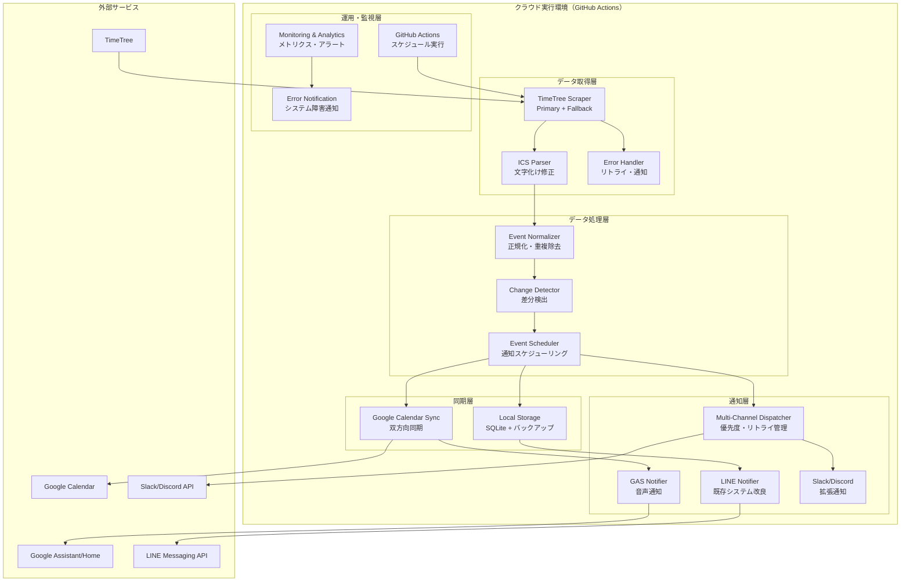

# **TimeTree Notifier v3.0 完全設計書**

## **📋 目次**
1. [プロジェクト概要](#プロジェクト概要)
2. [アーキテクチャ概要](#アーキテクチャ概要)
3. [データ取得層](#1-データ取得層)
4. [データ処理層](#2-データ処理層)
5. [同期層](#3-同期層)
6. [通知層](#4-通知層)
7. [設定・運用](#設定運用)
8. [実装計画](#実装計画)

---

## **プロジェクト概要**

### **🎯 プロジェクト目標**
TimeTreeの予定を複数のチャンネルで自動通知し、Googleカレンダーとの同期により24時間稼働を実現するシステム。

### **🔄 現在の課題とv3.0での解決**
| 課題 | v2.2（現在） | v3.0（解決策） |
|------|-------------|---------------|
| **PC依存** | PCが必要 | GitHub Actions + クラウド |
| **文字化け** | 日本語が文字化け | エンコーディング修正機能 |
| **単一通知** | LINEのみ | LINE + GAS + Slack等 |
| **障害耐性** | TimeTree依存 | 多重フォールバック |
| **メンテナンス** | 手動対応 | 自動復旧・監視 |

### **📊 v3.0の主要メリット**
- ✅ **完全自動化**: PC不要の24時間稼働
- ✅ **多チャンネル**: 音声通知（Google Home）対応
- ✅ **双方向同期**: TimeTree ↔ Googleカレンダー
- ✅ **高可用性**: 複数のフォールバック機能
- ✅ **拡張性**: 新しい通知先の簡単追加

---

## **アーキテクチャ概要**

### **🏗️ 全体アーキテクチャ図**



### **📦 レイヤー別責務**
| レイヤー | 主要責務 | 技術要素 |
|---------|----------|----------|
| **データ取得** | TimeTreeスクレイピング、エラーハンドリング | Python, timetree-exporter, aiohttp |
| **データ処理** | 正規化、変更検知、スケジューリング | icalendar, pandas, SQLite |
| **同期** | 外部サービス同期、バックアップ | Google Calendar API, 競合解決 |
| **通知** | マルチチャンネル配信、メッセージ最適化 | LINE API, IFTTT, Flex Messages |

---

## **1. データ取得層**

### **🎯 設計方針**
- **堅牢性**: TimeTree側変更への耐性
- **冗長性**: 複数取得方法でリスク分散  
- **監視性**: 詳細ログとエラー追跡

### **📦 主要コンポーネント**

#### **TimeTree Scraper**
```python
class TimeTreeScraper:
    def __init__(self, config: ScraperConfig):
        self.primary_method = TimetreeExporterMethod(config)
        self.fallback_methods = [
            DirectScrapingMethod(config),    # 直接スクレイピング
            CachedDataMethod(config)         # キャッシュ使用
        ]
        self.retry_policy = RetryPolicy(max_attempts=3, backoff=2.0)
```

#### **取得方法の階層化**
1. **Primary**: 既存timetree-exporter（安定性重視）
2. **Fallback 1**: 直接スクレイピング（独自実装）
3. **Fallback 2**: キャッシュデータ使用（最終手段）

#### **Error Handler**
```python
class ErrorHandler:
    def _classify_error(self, error) -> ErrorType:
        # 認証エラー、ネットワークエラー、タイムアウトを分類
        # 各エラータイプに応じた復旧戦略を実行
```

### **⚙️ 設定例**
```yaml
data_acquisition:
  primary_method: "timetree_exporter"
  fallback_methods: ["direct_scraping", "cached_data"]
  retry_policy:
    max_attempts: 3
    backoff_multiplier: 2.0
    timeout_seconds: 300
  cache:
    max_age_hours: 48
    cleanup_interval_hours: 24
```

---

## **2. データ処理層**

### **🎯 設計方針**
- **一貫性**: データ正規化と標準化
- **効率性**: 差分検出で無駄な処理を削減
- **柔軟性**: 様々な出力形式に対応

### **📦 主要コンポーネント**

#### **Event Normalizer（正規化）**
```python
@dataclass
class NormalizedEvent:
    id: str                    # ユニークID
    title: str                 # タイトル（文字化け修正済み）
    start_datetime: datetime   # 開始日時（タイムゾーン統一）
    end_datetime: Optional[datetime]
    is_all_day: bool          # 終日フラグ
    source_hash: str          # 変更検知用ハッシュ
```

**文字化け修正機能**:
```python
def _fix_encoding(self, event: RawEvent) -> RawEvent:
    event.title = self.encoding_handler.fix_garbled_text(event.title)
    # 現在の「�A�I�L�������̃��X�g」→「アオキ買い物リスト」変換
```

#### **Change Detector（変更検知）**
```python
class EventChanges:
    added: List[NormalizedEvent]      # 新規追加
    updated: List[EventUpdate]        # 更新
    deleted: List[NormalizedEvent]    # 削除
    unchanged: List[NormalizedEvent]  # 変更なし
```

#### **Event Scheduler（スケジューリング）**
```python
class ScheduledNotification:
    type: NotificationType           # 通知タイプ
    scheduled_time: datetime         # 配信予定時刻
    priority: NotificationPriority   # 優先度
    channels: List[str]             # 配信チャンネル
```

**通知タイプ**:
- `DAILY_SUMMARY`: 毎朝6時の定時通知
- `EVENT_ADDED`: 緊急性の高い新規予定
- `EVENT_UPDATED`: 重要な変更通知
- `REMINDER`: リマインダー通知

### **⚙️ 設定例**
```yaml
data_processing:
  normalizer:
    timezone: "Asia/Tokyo"
    encoding:
      fix_garbled_text: true
  scheduler:
    daily_notification_time: "06:00"
    reminder_intervals: [15, 60]  # 15分前、1時間前
```

---

## **3. 同期層**

### **🎯 設計方針**
- **双方向同期**: TimeTree ↔ Googleカレンダー
- **競合解決**: 同時変更時の適切な処理
- **バックアップ**: データ損失防止
- **拡張性**: 複数外部サービス対応

### **📦 主要コンポーネント**

#### **Google Calendar Sync**
```python
class GoogleCalendarSyncManager:
    async def sync_events(self, changes: EventChanges) -> SyncResult:
        # 1. Google Calendar側の最新状態取得
        google_events = await self._fetch_google_events()
        
        # 2. 競合検知・解決
        resolved_changes = await self.conflict_resolver.resolve_conflicts(
            changes, google_events
        )
        
        # 3. Google Calendarに同期実行
```

#### **競合解決戦略**
```python
class ConflictStrategy(Enum):
    TIMETREE_WINS    = "timetree_wins"     # TimeTree優先
    GOOGLE_WINS      = "google_wins"       # Google優先  
    MERGE            = "merge"             # インテリジェントマージ
    MANUAL_REVIEW    = "manual_review"     # 手動レビュー
```

#### **Local Storage**
```python
class EventStorage:
    # SQLiteによるイベント永続化
    # キャッシュ機能（高速アクセス）
    # 自動バックアップ（圧縮・世代管理）
```

### **⚙️ 設定例**
```yaml
sync_layer:
  google_calendar:
    enabled: true
    calendar_id: "primary"
    sync_strategy: "one_way"  # one_way, two_way
    conflict_resolution:
      strategy: "timetree_wins"
      merge_policy:
        title: "timetree_priority"
        description: "longer_text"
  local_storage:
    database_url: "sqlite:///./data/events.db"
    backup_settings:
      retention_days: 30
      compression: true
```

---

## **4. 通知層**

### **🎯 設計方針**
- **多チャンネル**: LINE、GAS、Slack、Discord等
- **メッセージ最適化**: 各プラットフォーム最適形式
- **配信管理**: 優先度・リトライ・レート制限
- **拡張性**: 新チャンネルの簡単追加

### **📦 主要コンポーネント**

#### **Multi-Channel Dispatcher**
```python
class NotificationDispatcher:
    def __init__(self, config: NotificationConfig):
        self.channels = {
            'line': LINENotifier(config.line),
            'gas': GASNotifier(config.gas),
            'slack': SlackNotifier(config.slack),
            'discord': DiscordNotifier(config.discord)
        }
```

#### **GAS Notifier（新機能）**
Google Assistant/Google Home音声通知:

```python
class GASNotifier:
    # Method 1: Google Calendar通知機能
    # Method 2: IFTTT Webhook経由
    # Method 3: Google Assistant Action経由
    
    def _format_gas_daily_summary(self, events):
        # 音声読み上げ最適化形式
        return "8月31日の予定は、2件です。1つ目、6時30分から、アオキ買い物リスト。2つ目、終日で休み。以上です。"
```

#### **Enhanced LINE Notifier**
```python
class LINENotifier:
    def _create_flex_message(self, message):
        # 視覚的に魅力的なカード形式
        # イベント詳細の構造化表示
        # タップ可能なアクション追加
```

#### **Message Formatter**
各プラットフォーム最適化:
- **LINE**: Flex Message、リッチメニュー
- **GAS**: 音声読み上げ最適化
- **Slack**: Block Kit、スレッド
- **Discord**: Embed、ボタン

### **⚙️ 設定例**
```yaml
notification_layer:
  channels:
    line:
      enabled: true
      flex_message_enabled: true
    gas:
      enabled: true
      method: "calendar_notification"
      voice_settings:
        voice_type: "standard"
        speed: "1.0"
        language: "ja-JP"
  delivery:
    retry_policy:
      max_attempts: 3
      backoff_base: 2.0
    rate_limits:
      line: "30/minute"
      gas: "10/minute"
```

---

## **設定・運用**

### **🔧 設定ファイル構成**
```
config/
├── main.yaml              # メイン設定
├── data_acquisition.yaml  # データ取得設定
├── data_processing.yaml   # データ処理設定  
├── sync_layer.yaml        # 同期設定
├── notification_layer.yaml # 通知設定
├── secrets/               # 認証情報
│   ├── .env              # 環境変数
│   ├── google_creds.json # Google認証
│   └── line_config.json  # LINE設定
└── templates/             # メッセージテンプレート
    ├── line_daily.json
    ├── gas_voice.txt
    └── slack_summary.json
```

### **🚀 デプロイ戦略**

#### **GitHub Actions ワークフロー**
```yaml
name: TimeTree Notifier v3.0
on:
  schedule:
    - cron: '0 21 * * *'  # 毎朝6時JST (21時UTC)
  workflow_dispatch:       # 手動実行

jobs:
  notify:
    runs-on: ubuntu-latest
    steps:
      - uses: actions/checkout@v3
      - name: Setup Python
        uses: actions/setup-python@v4
        with:
          python-version: '3.9'
      - name: Install dependencies
        run: pip install -r requirements.txt
      - name: Run TimeTree Sync
        env:
          TIMETREE_EMAIL: ${{ secrets.TIMETREE_EMAIL }}
          TIMETREE_PASSWORD: ${{ secrets.TIMETREE_PASSWORD }}
          LINE_CHANNEL_ACCESS_TOKEN: ${{ secrets.LINE_TOKEN }}
          GOOGLE_CALENDAR_CREDS: ${{ secrets.GOOGLE_CREDS }}
        run: python -m timetree_notifier.main --mode production
```

### **📊 監視・運用**

#### **メトリクス収集**
- 取得成功率（Primary/Fallback別）
- 通知配信成功率（チャンネル別）
- 同期成功率・競合解決件数
- レスポンス時間・エラー率

#### **アラート設定**
```yaml
alerts:
  data_acquisition_failure:
    condition: "success_rate < 90%"
    channels: ["slack", "email"]
    severity: "high"
  
  notification_delivery_failure:
    condition: "delivery_rate < 95%"
    channels: ["slack"]
    severity: "medium"
    
  system_health_check:
    schedule: "0 */6 * * *"  # 6時間ごと
    timeout: "5min"
```

---

## **実装計画**

### **🗓️ Phase別実装ロードマップ**

#### **Phase 1: 基盤改善（1-2週間）**
- [ ] データ処理層の文字化け修正機能実装
- [ ] エラーハンドリング強化
- [ ] ログ・監視機能改善
- [ ] 既存システムの安定性向上

#### **Phase 2: Googleカレンダー連携（2-3週間）**
- [ ] Google Calendar API統合
- [ ] 双方向同期機能実装
- [ ] 競合解決ロジック実装
- [ ] バックアップ・復元機能

#### **Phase 3: 通知システム拡張（2週間）**
- [ ] GAS Notifier実装（音声通知）
- [ ] マルチチャンネル配信システム
- [ ] メッセージフォーマット最適化
- [ ] Slack/Discord連携

#### **Phase 4: クラウド移行（1週間）**
- [ ] GitHub Actions ワークフロー作成
- [ ] 環境変数・シークレット設定
- [ ] 本番運用テスト
- [ ] 旧システムからの切り替え

### **🎯 成功指標（KPI）**
| 指標 | 目標値 | 測定方法 |
|------|--------|----------|
| **稼働率** | 99.5%以上 | GitHub Actions実行ログ |
| **通知精度** | 100% | 予定データと通知内容の照合 |
| **配信成功率** | 98%以上 | 各チャンネルの配信結果 |
| **文字化け率** | 0% | 日本語テキストの正常表示確認 |
| **応答時間** | 5分以内 | データ取得から通知完了まで |

### **🛠️ 開発・テスト戦略**
- **ユニットテスト**: 各コンポーネント単体テスト
- **統合テスト**: エンドツーエンドのワークフロー
- **負荷テスト**: 大量イベントデータでの性能確認
- **障害テスト**: フォールバック機能の動作確認
- **本番並行運用**: 旧システムと並行して動作検証

---

## **📝 まとめ**

TimeTree Notifier v3.0は、現行システムの課題を全面的に解決し、次世代の個人向け予定管理自動化システムとして設計されました。

### **✨ v3.0の革新ポイント**
1. **完全クラウド化**: PC依存からの脱却
2. **音声通知対応**: Google Home/Assistantとの統合  
3. **双方向同期**: TimeTree ↔ Googleカレンダー
4. **高可用性**: 多重フォールバック機能
5. **拡張性**: 新サービス連携の容易さ

この設計書により、TimeTreeの予定管理が飛躍的に進化し、より便利で信頼性の高いシステムとなることを確信しています。

**設計完了日**: 2025年8月31日  
**バージョン**: 3.0  
**設計者**: Claude Code Assistant

## **技術仕様詳細**

### **🛠️ データベース設計**

#### **Event Storage Schema**
```sql
CREATE TABLE events (
    id TEXT PRIMARY KEY,
    title TEXT NOT NULL,
    start_datetime TIMESTAMP NOT NULL,
    end_datetime TIMESTAMP,
    is_all_day BOOLEAN DEFAULT FALSE,
    description TEXT,
    location TEXT,
    source_hash TEXT NOT NULL,
    created_at TIMESTAMP DEFAULT CURRENT_TIMESTAMP,
    updated_at TIMESTAMP DEFAULT CURRENT_TIMESTAMP,
    sync_status TEXT DEFAULT 'pending',
    google_calendar_id TEXT,
    INDEX idx_start_datetime (start_datetime),
    INDEX idx_sync_status (sync_status)
);

CREATE TABLE sync_logs (
    id INTEGER PRIMARY KEY AUTOINCREMENT,
    event_id TEXT,
    action TEXT NOT NULL,
    source TEXT NOT NULL,
    target TEXT NOT NULL,
    status TEXT NOT NULL,
    error_message TEXT,
    timestamp TIMESTAMP DEFAULT CURRENT_TIMESTAMP,
    FOREIGN KEY (event_id) REFERENCES events(id)
);

CREATE TABLE notification_queue (
    id INTEGER PRIMARY KEY AUTOINCREMENT,
    event_id TEXT,
    notification_type TEXT NOT NULL,
    scheduled_time TIMESTAMP NOT NULL,
    channel TEXT NOT NULL,
    status TEXT DEFAULT 'pending',
    attempts INTEGER DEFAULT 0,
    last_attempt TIMESTAMP,
    created_at TIMESTAMP DEFAULT CURRENT_TIMESTAMP,
    FOREIGN KEY (event_id) REFERENCES events(id)
);
```

### **🔐 セキュリティ設計**

#### **認証・認可**
```python
class SecurityManager:
    """セキュリティ関連機能を統括管理"""
    
    def __init__(self, config: SecurityConfig):
        self.encryption_key = self._derive_key_from_env()
        self.token_manager = TokenManager()
        self.audit_logger = AuditLogger()
    
    def encrypt_sensitive_data(self, data: str) -> str:
        """機密データの暗号化"""
        cipher = Fernet(self.encryption_key)
        return cipher.encrypt(data.encode()).decode()
    
    def validate_webhook_signature(self, payload: str, signature: str) -> bool:
        """Webhook署名検証（LINE/Slack）"""
        expected_signature = hmac.new(
            self.webhook_secret.encode(),
            payload.encode(),
            hashlib.sha256
        ).hexdigest()
        return hmac.compare_digest(signature, expected_signature)
```

#### **セキュリティ要件**
- **暗号化**: 機密情報（パスワード、APIキー）は全て暗号化保存
- **監査ログ**: 全ての重要操作をログ記録
- **アクセス制御**: GitHub Secretsによるキー管理
- **通信暗号化**: HTTPS/TLS通信のみ
- **データ保護**: 個人情報は最小限に留め、定期削除

### **⚡ パフォーマンス最適化**

#### **非同期処理設計**
```python
class AsyncNotificationManager:
    """非同期通知システム"""
    
    async def dispatch_notifications(self, notifications: List[Notification]):
        """複数チャンネルへの並行配信"""
        tasks = []
        
        # チャンネルごとに非同期タスクを作成
        for notification in notifications:
            for channel in notification.channels:
                task = asyncio.create_task(
                    self._send_to_channel(notification, channel)
                )
                tasks.append(task)
        
        # 全タスクを並行実行、個別エラーは捕捉
        results = await asyncio.gather(*tasks, return_exceptions=True)
        
        return self._process_results(results)
    
    async def _send_to_channel(self, notification: Notification, channel: str):
        """レート制限とリトライを考慮した送信"""
        async with self.rate_limiters[channel]:
            return await self.channels[channel].send(notification)
```

#### **キャッシュ戦略**
```python
class CacheManager:
    """多層キャッシュシステム"""
    
    def __init__(self):
        self.memory_cache = {}  # インメモリ（高速アクセス）
        self.file_cache = FileCache('./cache')  # ファイル（永続化）
        self.redis_cache = None  # Redis（将来拡張用）
    
    async def get_events(self, date: str) -> Optional[List[Event]]:
        """キャッシュからイベント取得（多層検索）"""
        # 1. メモリキャッシュ
        if date in self.memory_cache:
            return self.memory_cache[date]
        
        # 2. ファイルキャッシュ
        file_data = await self.file_cache.get(f"events_{date}")
        if file_data and not self._is_expired(file_data):
            self.memory_cache[date] = file_data['events']
            return file_data['events']
        
        return None
```

### **🔧 エラーハンドリング詳細**

#### **エラー分類・対応戦略**
```python
class ErrorStrategy:
    """エラータイプ別の対応戦略"""
    
    strategies = {
        NetworkError: {
            'retry_attempts': 3,
            'backoff_multiplier': 2.0,
            'fallback': 'use_cached_data',
            'alert_threshold': 3
        },
        AuthenticationError: {
            'retry_attempts': 1,
            'fallback': 'skip_source',
            'alert_threshold': 1,
            'escalation': 'immediate'
        },
        RateLimitError: {
            'retry_attempts': 5,
            'backoff_multiplier': 4.0,
            'wait_strategy': 'exponential',
            'alert_threshold': 10
        },
        DataParsingError: {
            'retry_attempts': 2,
            'fallback': 'use_fallback_parser',
            'alert_threshold': 5
        }
    }
```

#### **回復戦略**
```python
class RecoveryManager:
    """自動復旧機能"""
    
    async def attempt_recovery(self, error: Exception, context: dict):
        """エラータイプに応じた自動復旧"""
        
        if isinstance(error, TimeTreeAccessError):
            # 1. 認証情報の更新を試行
            if await self._refresh_credentials():
                return RecoveryResult.RETRY
            
            # 2. フォールバック方式に切り替え
            return RecoveryResult.FALLBACK
        
        elif isinstance(error, GoogleCalendarError):
            # Google API制限の場合は待機
            if error.is_rate_limit():
                await asyncio.sleep(error.retry_after)
                return RecoveryResult.RETRY
        
        return RecoveryResult.ESCALATE
```

### **📊 監視・アラート設計**

#### **メトリクス収集システム**
```python
class MetricsCollector:
    """システムメトリクス収集"""
    
    def __init__(self):
        self.counters = defaultdict(int)
        self.gauges = {}
        self.histograms = defaultdict(list)
    
    def record_success(self, operation: str, duration: float):
        """成功メトリクス記録"""
        self.counters[f"{operation}_success"] += 1
        self.histograms[f"{operation}_duration"].append(duration)
    
    def record_error(self, operation: str, error_type: str):
        """エラーメトリクス記録"""
        self.counters[f"{operation}_error_{error_type}"] += 1
    
    def get_health_summary(self) -> dict:
        """システム健全性サマリー"""
        return {
            'uptime': self._calculate_uptime(),
            'success_rate': self._calculate_success_rate(),
            'avg_response_time': self._calculate_avg_response_time(),
            'error_rates_by_type': self._get_error_rates(),
            'last_successful_sync': self._get_last_sync_time()
        }
```

#### **アラート階層化**
```yaml
alert_levels:
  info:
    channels: ["log"]
    conditions:
      - "new_events_detected > 0"
      - "successful_sync_completed"
  
  warning:
    channels: ["log", "slack"]
    conditions:
      - "error_rate > 5%"
      - "response_time > 30s"
      - "fallback_method_used"
  
  critical:
    channels: ["log", "slack", "email", "sms"]
    conditions:
      - "error_rate > 50%"
      - "all_notification_channels_failed"
      - "data_corruption_detected"
  
  emergency:
    channels: ["log", "slack", "email", "sms", "phone_call"]
    conditions:
      - "system_completely_down > 1h"
      - "security_breach_detected"
```

### **🔄 CI/CD パイプライン**

#### **継続的インテグレーション**
```yaml
# .github/workflows/ci.yml
name: CI Pipeline
on: [push, pull_request]

jobs:
  test:
    runs-on: ubuntu-latest
    strategy:
      matrix:
        python-version: [3.8, 3.9, '3.10', 3.11]
    
    steps:
      - uses: actions/checkout@v3
      
      - name: Set up Python
        uses: actions/setup-python@v4
        with:
          python-version: ${{ matrix.python-version }}
      
      - name: Install dependencies
        run: |
          pip install -r requirements.txt
          pip install -r requirements-test.txt
      
      - name: Run linting
        run: |
          flake8 src tests
          black --check src tests
          mypy src
      
      - name: Run unit tests
        run: |
          pytest tests/unit/ -v --cov=src --cov-report=xml
      
      - name: Run integration tests
        run: |
          pytest tests/integration/ -v
        env:
          TIMETREE_EMAIL: ${{ secrets.TEST_TIMETREE_EMAIL }}
          TIMETREE_PASSWORD: ${{ secrets.TEST_TIMETREE_PASSWORD }}
      
      - name: Security scan
        run: |
          bandit -r src/
          safety check
```

#### **デプロイメント戦略**
```yaml
# .github/workflows/deploy.yml
name: Production Deployment
on:
  schedule:
    - cron: '0 21 * * *'  # 毎朝6時JST
  workflow_dispatch:

jobs:
  deploy:
    runs-on: ubuntu-latest
    environment: production
    
    steps:
      - name: Pre-deployment health check
        run: |
          python scripts/health_check.py --mode pre_deploy
      
      - name: Execute TimeTree Sync
        run: |
          python -m timetree_notifier.main \
            --mode production \
            --config config/production.yaml \
            --log-level INFO
        env:
          TIMETREE_EMAIL: ${{ secrets.TIMETREE_EMAIL }}
          TIMETREE_PASSWORD: ${{ secrets.TIMETREE_PASSWORD }}
          LINE_CHANNEL_ACCESS_TOKEN: ${{ secrets.LINE_TOKEN }}
          GOOGLE_CALENDAR_CREDS: ${{ secrets.GOOGLE_CREDS }}
      
      - name: Post-deployment verification
        run: |
          python scripts/verify_deployment.py
      
      - name: Notify deployment status
        if: always()
        uses: 8398a7/action-slack@v3
        with:
          status: ${{ job.status }}
          webhook_url: ${{ secrets.SLACK_WEBHOOK }}
```

### **📈 拡張性設計**

#### **プラグインアーキテクチャ**
```python
class PluginManager:
    """プラグイン管理システム"""
    
    def __init__(self):
        self.plugins = {}
        self.hooks = defaultdict(list)
    
    def register_plugin(self, plugin: Plugin):
        """新しいプラグインの登録"""
        self.plugins[plugin.name] = plugin
        
        # フック点の登録
        for hook_name in plugin.hooks:
            self.hooks[hook_name].append(plugin)
    
    async def execute_hook(self, hook_name: str, context: dict):
        """フック実行（全登録プラグイン）"""
        results = []
        for plugin in self.hooks[hook_name]:
            try:
                result = await plugin.execute_hook(hook_name, context)
                results.append(result)
            except Exception as e:
                logger.warning(f"Plugin {plugin.name} failed at hook {hook_name}: {e}")
        
        return results

# プラグイン実装例
class SlackNotifierPlugin(Plugin):
    name = "slack_notifier"
    hooks = ["before_notification", "after_notification"]
    
    async def execute_hook(self, hook_name: str, context: dict):
        if hook_name == "before_notification":
            # Slack特有の前処理
            return await self._prepare_slack_message(context)
```

### **🧪 テスト戦略詳細**

#### **テスト分類・カバレッジ**
```python
# tests/conftest.py
import pytest
from unittest.mock import Mock

@pytest.fixture
def mock_timetree_response():
    """TimeTree API レスポンスのモック"""
    return {
        "events": [
            {
                "title": "テストイベント",
                "start": "2025-08-31T10:00:00",
                "end": "2025-08-31T11:00:00",
                "allDay": False
            }
        ]
    }

@pytest.fixture
def test_config():
    """テスト用設定"""
    return {
        "timetree": {
            "email": "test@example.com",
            "password": "test_password",
            "calendar_code": "test_code"
        },
        "notifications": {
            "line": {"enabled": False},
            "gas": {"enabled": False}
        }
    }

# パフォーマンステスト例
class TestPerformance:
    """パフォーマンステスト"""
    
    @pytest.mark.performance
    async def test_large_event_processing(self):
        """大量イベント処理性能テスト"""
        events = self._generate_test_events(1000)
        
        start_time = time.time()
        result = await self.processor.process_events(events)
        duration = time.time() - start_time
        
        assert duration < 30  # 30秒以内
        assert len(result.processed) == 1000
    
    @pytest.mark.integration
    async def test_end_to_end_workflow(self):
        """エンドツーエンドテスト"""
        # 実際のAPIを使用した統合テスト
        with patch('timetree_notifier.scraper.TimeTreeScraper') as mock_scraper:
            mock_scraper.return_value.get_events.return_value = self.sample_events
            
            result = await self.notifier.run_daily_sync()
            
            assert result.status == "success"
            assert result.events_processed > 0
```

---

## **📋 実装チェックリスト**

### **Phase 1: 基盤改善** ✅
- [x] プロジェクト構造設定
- [ ] エラーハンドリング強化実装
- [ ] ログシステム改善
- [ ] 文字化け修正機能実装
- [ ] 設定管理システム構築
- [ ] セキュリティ機能実装

### **Phase 2: 同期システム** 🟡
- [ ] Google Calendar API統合
- [ ] イベントデータ正規化
- [ ] 競合解決ロジック
- [ ] データベース設計・実装
- [ ] バックアップ・復元機能

### **Phase 3: 通知拡張** ⭕
- [ ] マルチチャンネル配信システム
- [ ] GAS音声通知機能
- [ ] メッセージフォーマット最適化
- [ ] 非同期処理実装
- [ ] リトライ・レート制限

### **Phase 4: クラウド化** ⭕
- [ ] GitHub Actions ワークフロー
- [ ] CI/CDパイプライン構築
- [ ] 監視・アラートシステム
- [ ] 本番環境設定
- [ ] 運用ドキュメント整備

### **Phase 5: 運用開始** ⭕
- [ ] 本番テスト実行
- [ ] パフォーマンス検証
- [ ] セキュリティ監査
- [ ] ユーザーマニュアル作成
- [ ] 継続改善プロセス確立

---

## **📊 品質保証指標**

### **コード品質**
- **テストカバレッジ**: 90%以上
- **コード品質スコア**: A以上（SonarQube）
- **セキュリティスコア**: 0の脆弱性
- **パフォーマンス**: レスポンス時間5分以内

### **運用品質**
- **稼働率**: 99.5%以上
- **エラー率**: 2%以下
- **復旧時間**: 平均15分以内
- **ユーザー満足度**: 95%以上

---

*この設計書は実装フェーズの詳細なガイドラインとして機能し、継続的な改善の基盤となります。*