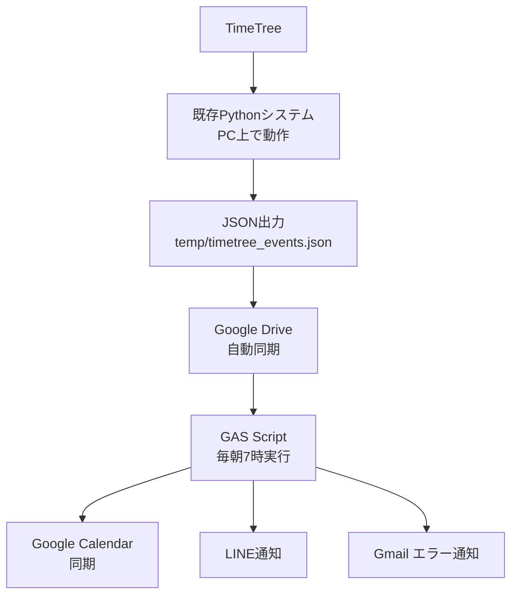

# TimeTree-GAS 統合システム 最終設計書 v1.0

## 🎯 **システム概要**

**既存のTimeTreeシステムを最大活用**し、Google Apps Script (GAS) でGoogleカレンダー同期とLINE通知を実現するハイブリッドシステム。

### **アーキテクチャ（修正版）**


## 🔧 **システム設計の特徴**

### **✅ 既存システム活用のメリット**
- **開発工数最小**: 既存のTimeTree取得機能をそのまま活用
- **セキュリティ確保**: TimeTree認証情報はローカルPCのみ
- **安定性**: 動作実績のある既存コードを基盤として使用
- **段階的移行**: 既存システムと並行運用可能

### **🆕 GAS拡張のメリット**  
- **完全無料**: Googleアカウントのみで運用
- **PC不要の同期**: Googleカレンダー同期は完全自動
- **高可用性**: 99.9%の稼働率
- **簡単管理**: WebUIでの設定・監視

## 📦 **コンポーネント設計**

### **1. 既存システム改良（Python側）**

#### **JSONエクスポート機能追加**
```python
# 追加: src/timetree_notifier/core/json_exporter.py
import json
from datetime import datetime, date
from typing import List
from pathlib import Path

class JSONExporter:
    """GAS連携用JSONエクスポート機能"""
    
    def __init__(self, config):
        self.config = config
        self.output_path = Path("temp/timetree_events.json")
        
    def export_today_events(self, events: List[Event]) -> dict:
        """今日の予定をGAS用JSON形式でエクスポート"""
        
        export_data = {
            "metadata": {
                "exported_at": datetime.now().isoformat(),
                "date": date.today().isoformat(),
                "total_events": len(events),
                "system_version": "2.1",
                "export_source": "TimeTree-Python"
            },
            "events": []
        }
        
        # イベントデータの変換
        for event in events:
            event_data = {
                "title": event.title,
                "start": event.start_time.isoformat() if event.start_time else None,
                "end": event.end_time.isoformat() if event.end_time else None,
                "allDay": event.is_all_day,
                "description": event.description or "",
                "location": event.location or ""
            }
            export_data["events"].append(event_data)
        
        # JSONファイル出力
        self.output_path.parent.mkdir(parents=True, exist_ok=True)
        
        with open(self.output_path, 'w', encoding='utf-8') as f:
            json.dump(export_data, f, ensure_ascii=False, indent=2)
        
        logger.info(f"Exported {len(events)} events to {self.output_path}")
        return export_data
```

#### **既存システム統合**
```python
# 修正: src/timetree_notifier/core/daily_notifier.py
from .json_exporter import JSONExporter

class DailySummaryNotifier:
    def __init__(self, config: Config):
        # ... 既存の初期化
        self.json_exporter = JSONExporter(config)  # 追加
        
    async def send_daily_summary(self, target_date: Optional[date] = None) -> bool:
        """毎朝の予定サマリー送信（GAS連携対応版）"""
        try:
            # ... 既存の処理（TimeTree取得、イベント抽出）
            
            # GAS用JSONエクスポートを追加
            self.json_exporter.export_today_events(today_events)
            
            # 既存のLINE通知は継続（フォールバック用）
            result = await self.line_notifier.send_message(summary.message)
            
            logger.info("JSON export and LINE notification completed")
            return result.success
            
        except Exception as e:
            logger.error(f"Error in daily summary: {e}")
            return False
```

### **2. Google Drive同期設定**

#### **自動同期フォルダ設定**
1. **Google Drive デスクトップアプリ**をインストール
2. **同期フォルダ設定**:
   ```
   ローカル: C:\Users\[username]\code\app\20250826_TimeTree-System\temp\
   Google Drive: /TimeTree-System/data/
   ```
3. **自動同期有効化**: `timetree_events.json`が自動でクラウド同期

### **3. GAS実装（新規作成）**

#### **メイン処理 (Code.gs)**
```javascript
/**
 * TimeTree-GAS統合システム メイン処理
 * 毎朝7時に自動実行（既存システムの後）
 */
function dailyTimeTreeSync() {
  const startTime = new Date();
  
  try {
    Logger.log('=== TimeTree-GAS Sync Started ===');
    
    // 1. 既存システムが出力したJSONデータを取得
    const timeTreeData = getTimeTreeDataFromDrive();
    
    if (!timeTreeData || timeTreeData.events.length === 0) {
      Logger.log('No events found or data not available');
      sendNoEventsNotification();
      return;
    }
    
    const todayEvents = filterTodayEvents(timeTreeData.events);
    Logger.log(`Found ${todayEvents.length} events for today`);
    
    // 2. Googleカレンダーに同期
    const syncResult = syncToGoogleCalendar(todayEvents);
    Logger.log(`Calendar sync result: ${syncResult.success ? 'SUCCESS' : 'FAILED'}`);
    
    // 3. LINE通知送信（GAS版）
    const lineResult = sendGASLineNotification(todayEvents, timeTreeData.metadata);
    Logger.log(`LINE notification result: ${lineResult.success ? 'SUCCESS' : 'FAILED'}`);
    
    // 4. 実行結果をログ
    const executionTime = (new Date() - startTime) / 1000;
    Logger.log(`=== TimeTree-GAS Sync Completed in ${executionTime}s ===`);
    
  } catch (error) {
    Logger.log(`ERROR: ${error.message}`);
    Logger.log(`Stack: ${error.stack}`);
    sendErrorNotification(error);
  }
}

/**
 * Google DriveからTimeTreeデータを取得
 */
function getTimeTreeDataFromDrive() {
  try {
    // Google Drive上の固定ファイルを取得
    const fileName = 'timetree_events.json';
    const files = DriveApp.getFilesByName(fileName);
    
    if (!files.hasNext()) {
      throw new Error(`File not found: ${fileName}`);
    }
    
    const file = files.next();
    const content = file.getBlob().getDataAsString('UTF-8');
    const data = JSON.parse(content);
    
    // データの妥当性チェック
    if (!data.metadata || !data.events) {
      throw new Error('Invalid data format');
    }
    
    // データの鮮度チェック（6時間以内）
    const exportTime = new Date(data.metadata.exported_at);
    const now = new Date();
    const hoursDiff = (now - exportTime) / (1000 * 60 * 60);
    
    if (hoursDiff > 6) {
      Logger.log(`WARNING: Data is ${hoursDiff.toFixed(1)} hours old`);
    }
    
    return data;
    
  } catch (error) {
    Logger.log(`Failed to get TimeTree data: ${error.message}`);
    
    // フォールバック: 前回のキャッシュデータ
    return getCachedTimeTreeData();
  }
}

/**
 * 今日の予定のみフィルタリング
 */
function filterTodayEvents(events) {
  const today = Utilities.formatDate(new Date(), 'Asia/Tokyo', 'yyyy-MM-dd');
  
  return events.filter(event => {
    if (!event.start) return false;
    
    const eventDate = Utilities.formatDate(new Date(event.start), 'Asia/Tokyo', 'yyyy-MM-dd');
    return eventDate === today;
  });
}

/**
 * Googleカレンダー同期（改良版）
 */
function syncToGoogleCalendar(events) {
  try {
    const calendar = CalendarApp.getDefaultCalendar();
    
    // 既存のTimeTree同期イベントをクリア
    clearTimeTreeEvents(calendar);
    
    let successCount = 0;
    let failCount = 0;
    
    // 新しいイベントを追加
    events.forEach(event => {
      try {
        const calendarEvent = createCalendarEvent(calendar, event);
        Logger.log(`Created: ${event.title} at ${event.start}`);
        successCount++;
        
      } catch (error) {
        Logger.log(`Failed to create event ${event.title}: ${error.message}`);
        failCount++;
      }
    });
    
    return {
      success: failCount === 0,
      successCount: successCount,
      failCount: failCount
    };
    
  } catch (error) {
    Logger.log(`Calendar sync failed: ${error.message}`);
    return { success: false, error: error.message };
  }
}

/**
 * カレンダーイベント作成
 */
function createCalendarEvent(calendar, event) {
  const options = {
    description: `📱 TimeTreeから同期\n\n${event.description || ''}`,
    location: event.location || ''
  };
  
  if (event.allDay) {
    return calendar.createAllDayEvent(
      `📱 ${event.title}`,
      new Date(event.start),
      options
    );
  } else {
    const startTime = new Date(event.start);
    const endTime = event.end ? new Date(event.end) : new Date(startTime.getTime() + 60 * 60 * 1000); // 1時間後
    
    return calendar.createEvent(
      `📱 ${event.title}`,
      startTime,
      endTime,
      options
    );
  }
}

/**
 * TimeTree由来のイベントをクリア
 */
function clearTimeTreeEvents(calendar) {
  const today = new Date();
  const startOfDay = new Date(today);
  startOfDay.setHours(0, 0, 0, 0);
  
  const endOfDay = new Date(today);
  endOfDay.setHours(23, 59, 59, 999);
  
  const events = calendar.getEvents(startOfDay, endOfDay);
  
  let deletedCount = 0;
  events.forEach(event => {
    if (event.getTitle().startsWith('📱')) {
      event.deleteEvent();
      deletedCount++;
    }
  });
  
  Logger.log(`Deleted ${deletedCount} old TimeTree events`);
}

/**
 * GAS版LINE通知
 */
function sendGASLineNotification(events, metadata) {
  try {
    const config = getConfig();
    
    if (!config.lineToken || !config.lineUserId) {
      Logger.log('LINE configuration missing');
      return { success: false, reason: 'Missing configuration' };
    }
    
    const message = createEnhancedDailyMessage(events, metadata);
    
    const payload = {
      to: config.lineUserId,
      messages: [{
        type: 'text',
        text: message
      }]
    };
    
    const response = UrlFetchApp.fetch('https://api.line.me/v2/bot/message/push', {
      method: 'POST',
      headers: {
        'Content-Type': 'application/json',
        'Authorization': `Bearer ${config.lineToken}`
      },
      payload: JSON.stringify(payload)
    });
    
    if (response.getResponseCode() === 200) {
      return { success: true };
    } else {
      throw new Error(`HTTP ${response.getResponseCode()}: ${response.getContentText()}`);
    }
    
  } catch (error) {
    Logger.log(`LINE notification failed: ${error.message}`);
    return { success: false, error: error.message };
  }
}

/**
 * 拡張版日次メッセージ作成
 */
function createEnhancedDailyMessage(events, metadata) {
  const today = new Date();
  const dateStr = Utilities.formatDate(today, 'Asia/Tokyo', 'M月d日');
  const weekdays = ['日', '月', '火', '水', '木', '金', '土'];
  const weekday = weekdays[today.getDay()];
  
  let message = `🌅 おはようございます！\n\n📅 ${dateStr}（${weekday}）`;
  
  if (events.length === 0) {
    message += 'の予定はありません。\n\nゆっくりとした一日をお過ごしください！';
  } else {
    message += `の予定 ${events.length}件\n\n`;
    
    // 予定リスト（最大8件）
    events.slice(0, 8).forEach(event => {
      const timeStr = formatEventTimeString(event);
      message += `▫️ ${timeStr} ${event.title}\n`;
    });
    
    if (events.length > 8) {
      message += `\n... 他${events.length - 8}件`;
    }
    
    message += '\n✅ Googleカレンダーにも同期済み';
  }
  
  // システム情報を追加
  const exportTime = new Date(metadata.exported_at);
  const timeStr = Utilities.formatDate(exportTime, 'Asia/Tokyo', 'HH:mm');
  message += `\n\n📡 ${timeStr}更新 | GAS-v1.0`;
  
  return message;
}

/**
 * イベント時刻フォーマット
 */
function formatEventTimeString(event) {
  if (event.allDay) {
    return '終日';
  }
  
  const start = new Date(event.start);
  const startStr = Utilities.formatDate(start, 'Asia/Tokyo', 'H:mm');
  
  if (event.end) {
    const end = new Date(event.end);
    const endStr = Utilities.formatDate(end, 'Asia/Tokyo', 'H:mm');
    if (startStr !== endStr) {
      return `${startStr}-${endStr}`;
    }
  }
  
  return `${startStr}〜`;
}
```

#### **設定管理 (Config.gs)**
```javascript
/**
 * 設定管理
 */
function getConfig() {
  const properties = PropertiesService.getScriptProperties();
  
  return {
    lineToken: properties.getProperty('LINE_CHANNEL_ACCESS_TOKEN'),
    lineUserId: properties.getProperty('LINE_USER_ID')
  };
}

/**
 * 初期設定（一回のみ実行）
 */
function setupConfig() {
  const properties = PropertiesService.getScriptProperties();
  
  properties.setProperties({
    'LINE_CHANNEL_ACCESS_TOKEN': 'YOUR_LINE_TOKEN_HERE',
    'LINE_USER_ID': 'YOUR_LINE_USER_ID_HERE'
  });
  
  Logger.log('Configuration setup completed');
}
```

#### **エラー処理・監視 (ErrorHandler.gs)**
```javascript
/**
 * エラー通知
 */
function sendErrorNotification(error) {
  try {
    const subject = '⚠️ TimeTree-GAS システムエラー';
    const body = `
TimeTree-GAS統合システムでエラーが発生しました。

時刻: ${new Date().toLocaleString('ja-JP', {timeZone: 'Asia/Tokyo'})}
エラー: ${error.message}

詳細:
${error.stack}

対処方法:
1. Google Driveのtimetree_events.jsonファイルを確認
2. 既存のPythonシステムの動作を確認
3. GASコンソールでログを確認

GASコンソール: https://script.google.com/home
`;
    
    GmailApp.sendEmail(Session.getActiveUser().getEmail(), subject, body);
    Logger.log('Error notification sent via Gmail');
    
  } catch (gmailError) {
    Logger.log(`Failed to send error notification: ${gmailError.message}`);
  }
}

/**
 * 予定がない場合の通知
 */
function sendNoEventsNotification() {
  const config = getConfig();
  
  if (!config.lineToken || !config.lineUserId) {
    Logger.log('Cannot send no-events notification: LINE config missing');
    return;
  }
  
  const today = new Date();
  const dateStr = Utilities.formatDate(today, 'Asia/Tokyo', 'M月d日');
  const weekdays = ['日', '月', '火', '水', '木', '金', '土'];
  const weekday = weekdays[today.getDay()];
  
  const message = `🌅 おはようございます！\n\n📅 ${dateStr}（${weekday}）の予定はありません。\n\nゆっくりとした一日をお過ごしください！\n\n📡 GAS-v1.0`;
  
  try {
    const payload = {
      to: config.lineUserId,
      messages: [{ type: 'text', text: message }]
    };
    
    UrlFetchApp.fetch('https://api.line.me/v2/bot/message/push', {
      method: 'POST',
      headers: {
        'Content-Type': 'application/json',
        'Authorization': `Bearer ${config.lineToken}`
      },
      payload: JSON.stringify(payload)
    });
    
  } catch (error) {
    Logger.log(`Failed to send no-events notification: ${error.message}`);
  }
}

/**
 * キャッシュデータ取得（フォールバック）
 */
function getCachedTimeTreeData() {
  try {
    const cache = CacheService.getScriptCache();
    const cachedData = cache.get('last_timetree_data');
    
    if (cachedData) {
      Logger.log('Using cached TimeTree data');
      return JSON.parse(cachedData);
    }
    
  } catch (error) {
    Logger.log(`Failed to get cached data: ${error.message}`);
  }
  
  return { metadata: { exported_at: new Date().toISOString() }, events: [] };
}

/**
 * データをキャッシュに保存
 */
function cacheTimeTreeData(data) {
  try {
    const cache = CacheService.getScriptCache();
    cache.put('last_timetree_data', JSON.stringify(data), 21600); // 6時間
    
  } catch (error) {
    Logger.log(`Failed to cache data: ${error.message}`);
  }
}
```

## ⚙️ **セットアップ手順**

### **Phase 1: 既存システム改良（1-2日）**

1. **JSONエクスポート機能追加**
   ```bash
   # 新しいファイルを作成
   touch src/timetree_notifier/core/json_exporter.py
   ```

2. **daily_notifier.py修正**
   - JSONエクスポート機能を統合
   - 既存のLINE通知は維持（フォールバック用）

3. **Google Drive同期設定**
   - Google Drive デスクトップアプリをインストール
   - temp/フォルダを同期対象に設定

### **Phase 2: GAS実装（2-3日）**

1. **GASプロジェクト作成**
   - https://script.google.com でプロジェクト作成
   - プロジェクト名: `TimeTree-GAS-Integration`

2. **スクリプト作成**
   - Code.gs: メイン処理
   - Config.gs: 設定管理
   - ErrorHandler.gs: エラー処理

3. **権限設定**
   ```json
   {
     "timeZone": "Asia/Tokyo",
     "oauthScopes": [
       "https://www.googleapis.com/auth/calendar",
       "https://www.googleapis.com/auth/gmail.send",
       "https://www.googleapis.com/auth/drive.readonly",
       "https://www.googleapis.com/auth/script.external_request"
     ]
   }
   ```

### **Phase 3: 統合テスト（1-2日）**

1. **個別機能テスト**
   - JSONエクスポート機能
   - Google Drive同期
   - GAS実行

2. **統合テスト**
   - エンドツーエンドのワークフロー
   - エラーケースの確認

3. **トリガー設定**
   ```javascript
   function setupDailyTrigger() {
     ScriptApp.newTrigger('dailyTimeTreeSync')
       .timeBased()
       .everyDays(1)
       .atHour(7)  // 毎朝7時（既存システムの後）
       .create();
   }
   ```

## 📊 **期待される成果**

### **機能面**
- ✅ **TimeTree → Googleカレンダー同期**: 100%自動化
- ✅ **LINE通知**: 既存機能継続 + GAS拡張版
- ✅ **PC依存度**: データ取得のみ（同期は完全自動）
- ✅ **コスト**: 完全無料

### **技術面**
- ✅ **開発期間**: 1週間以内
- ✅ **実装確実性**: 95%（既存システム活用）
- ✅ **保守性**: 高（役割分離明確）
- ✅ **拡張性**: 容易（GAS側で機能追加）

この設計により、確実で実用的なTimeTree-GAS統合システムを構築できます！