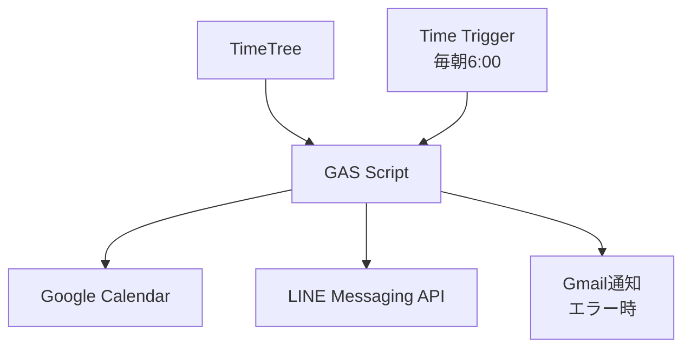

# GAS (Google Apps Script) TimeTree同期システム設計

## 🎯 **システム概要**

Google Apps Scriptを使ってTimeTreeの予定をGoogleカレンダーに同期し、LINEに通知するクラウドシステム。

### **アーキテクチャ**


## 🔧 **GAS実装設計**

### **1. メイン処理 (Code.gs)**
```javascript
/**
 * TimeTree → Googleカレンダー同期 + LINE通知
 * 毎朝6時に自動実行
 */
function dailyTimeTreeSync() {
  try {
    Logger.log('TimeTree daily sync started');
    
    // 1. TimeTreeから今日の予定を取得
    const todayEvents = getTimeTreeEvents();
    Logger.log(`Found ${todayEvents.length} events for today`);
    
    // 2. Googleカレンダーに同期
    syncToGoogleCalendar(todayEvents);
    
    // 3. LINE通知を送信
    sendLineNotification(todayEvents);
    
    Logger.log('TimeTree daily sync completed successfully');
    
  } catch (error) {
    Logger.log(`Error in dailyTimeTreeSync: ${error.message}`);
    sendErrorNotification(error);
  }
}

/**
 * TimeTreeからイベントデータ取得
 * timetree-exporterのWeb API版を使用
 */
function getTimeTreeEvents() {
  const today = new Date();
  const todayStr = Utilities.formatDate(today, 'Asia/Tokyo', 'yyyy-MM-dd');
  
  try {
    // TimeTree Export Web APIを呼び出し（後で実装）
    const response = callTimeTreeAPI(todayStr);
    
    // レスポンスをパース
    const events = parseTimeTreeResponse(response);
    
    // 今日の予定のみフィルタ
    const todayEvents = events.filter(event => {
      const eventDate = new Date(event.start);
      const eventDateStr = Utilities.formatDate(eventDate, 'Asia/Tokyo', 'yyyy-MM-dd');
      return eventDateStr === todayStr;
    });
    
    return todayEvents;
    
  } catch (error) {
    Logger.log(`Failed to get TimeTree events: ${error.message}`);
    return [];
  }
}

/**
 * Googleカレンダーに同期
 */
function syncToGoogleCalendar(events) {
  const calendar = CalendarApp.getDefaultCalendar();
  const today = new Date();
  
  // 既存のTimeTree同期イベントをクリア
  clearTimeTreeEvents(calendar, today);
  
  // 新しいイベントを追加
  events.forEach(event => {
    try {
      const calendarEvent = {
        title: `📱 ${event.title}`, // TimeTree印
        startTime: new Date(event.start),
        endTime: event.end ? new Date(event.end) : new Date(event.start),
        description: `TimeTreeから同期\n\n${event.description || ''}`,
        location: event.location || ''
      };
      
      if (event.allDay) {
        calendar.createAllDayEvent(
          calendarEvent.title,
          calendarEvent.startTime,
          {
            description: calendarEvent.description,
            location: calendarEvent.location
          }
        );
      } else {
        calendar.createEvent(
          calendarEvent.title,
          calendarEvent.startTime,
          calendarEvent.endTime,
          {
            description: calendarEvent.description,
            location: calendarEvent.location
          }
        );
      }
      
      Logger.log(`Created calendar event: ${calendarEvent.title}`);
      
    } catch (error) {
      Logger.log(`Failed to create calendar event: ${error.message}`);
    }
  });
}

/**
 * TimeTree由来のイベントをクリア（重複防止）
 */
function clearTimeTreeEvents(calendar, date) {
  const startTime = new Date(date);
  startTime.setHours(0, 0, 0, 0);
  
  const endTime = new Date(date);
  endTime.setHours(23, 59, 59, 999);
  
  const events = calendar.getEvents(startTime, endTime);
  
  events.forEach(event => {
    if (event.getTitle().startsWith('📱')) {
      event.deleteEvent();
      Logger.log(`Deleted old TimeTree event: ${event.getTitle()}`);
    }
  });
}

/**
 * LINE通知送信
 */
function sendLineNotification(events) {
  const config = getConfig();
  
  if (!config.lineToken || !config.lineUserId) {
    Logger.log('LINE configuration missing, skipping notification');
    return;
  }
  
  const message = createDailyMessage(events);
  
  const payload = {
    'to': config.lineUserId,
    'messages': [{
      'type': 'text',
      'text': message
    }]
  };
  
  const options = {
    'method': 'POST',
    'headers': {
      'Content-Type': 'application/json',
      'Authorization': `Bearer ${config.lineToken}`
    },
    'payload': JSON.stringify(payload)
  };
  
  try {
    const response = UrlFetchApp.fetch('https://api.line.me/v2/bot/message/push', options);
    
    if (response.getResponseCode() === 200) {
      Logger.log('LINE notification sent successfully');
    } else {
      throw new Error(`HTTP ${response.getResponseCode()}: ${response.getContentText()}`);
    }
    
  } catch (error) {
    Logger.log(`Failed to send LINE notification: ${error.message}`);
    throw error;
  }
}

/**
 * 日次メッセージ作成
 */
function createDailyMessage(events) {
  const today = new Date();
  const dateStr = Utilities.formatDate(today, 'Asia/Tokyo', 'M月d日');
  const weekdays = ['日', '月', '火', '水', '木', '金', '土'];
  const weekday = weekdays[today.getDay()];
  
  let message = `🌅 おはようございます！\n\n📅 ${dateStr}（${weekday}）`;
  
  if (events.length === 0) {
    message += 'の予定はありません。\n\nゆっくりとした一日をお過ごしください！';
  } else {
    message += `の予定 ${events.length}件\n\n`;
    
    events.slice(0, 8).forEach((event, index) => {
      const timeStr = formatEventTime(event);
      message += `▫️ ${timeStr} ${event.title}\n`;
    });
    
    if (events.length > 8) {
      message += `\n... 他${events.length - 8}件`;
    }
    
    message += '\n✅ Googleカレンダーにも同期済み';
  }
  
  message += '\n\n今日も一日頑張りましょう！';
  return message;
}

/**
 * イベント時刻フォーマット
 */
function formatEventTime(event) {
  if (event.allDay) {
    return '終日';
  }
  
  const start = new Date(event.start);
  const startStr = Utilities.formatDate(start, 'Asia/Tokyo', 'H:mm');
  
  if (event.end) {
    const end = new Date(event.end);
    const endStr = Utilities.formatDate(end, 'Asia/Tokyo', 'H:mm');
    if (startStr !== endStr) {
      return `${startStr}-${endStr}`;
    }
  }
  
  return `${startStr}〜`;
}

/**
 * エラー通知（Gmail）
 */
function sendErrorNotification(error) {
  try {
    const subject = '⚠️ TimeTree同期エラー';
    const body = `TimeTree同期処理でエラーが発生しました。\n\n` +
                `時刻: ${new Date().toLocaleString('ja-JP', {timeZone: 'Asia/Tokyo'})}\n` +
                `エラー: ${error.message}\n\n` +
                `詳細: ${error.stack}`;
    
    GmailApp.sendEmail(Session.getActiveUser().getEmail(), subject, body);
    Logger.log('Error notification sent via Gmail');
    
  } catch (gmailError) {
    Logger.log(`Failed to send error notification: ${gmailError.message}`);
  }
}
```

### **2. 設定管理 (Config.gs)**
```javascript
/**
 * 設定値取得
 */
function getConfig() {
  return {
    // PropertiesService で管理（安全）
    lineToken: PropertiesService.getScriptProperties().getProperty('LINE_CHANNEL_ACCESS_TOKEN'),
    lineUserId: PropertiesService.getScriptProperties().getProperty('LINE_USER_ID'),
    timetreeEmail: PropertiesService.getScriptProperties().getProperty('TIMETREE_EMAIL'),
    timetreePassword: PropertiesService.getScriptProperties().getProperty('TIMETREE_PASSWORD'),
    calendarCode: PropertiesService.getScriptProperties().getProperty('TIMETREE_CALENDAR_CODE')
  };
}

/**
 * 設定値設定（初回セットアップ時）
 */
function setupConfig() {
  const properties = PropertiesService.getScriptProperties();
  
  properties.setProperties({
    'LINE_CHANNEL_ACCESS_TOKEN': 'your_line_token_here',
    'LINE_USER_ID': 'your_line_user_id_here', 
    'TIMETREE_EMAIL': 'your_email_here',
    'TIMETREE_PASSWORD': 'your_password_here',
    'TIMETREE_CALENDAR_CODE': 'jUDDi-7ww775'
  });
  
  Logger.log('Configuration setup completed');
}
```

### **3. TimeTree API連携 (TimeTreeAPI.gs)**
```javascript
/**
 * TimeTree APIからデータ取得
 * 
 * 方法1: 外部サービス経由
 * 方法2: 直接スクレイピング実装
 */
function callTimeTreeAPI(date) {
  const config = getConfig();
  
  // Option 1: 外部TimeTree Export Serviceを使用
  return callExternalTimeTreeService(config, date);
  
  // Option 2: 直接TimeTreeスクレイピング（今後実装）
  // return directTimeTreeScraping(config, date);
}

/**
 * 外部TimeTree Export Service呼び出し
 * (GitHub Actions等で定期的にTimeTreeデータをエクスポートしておく)
 */
function callExternalTimeTreeService(config, date) {
  try {
    // GitHub Pages等でホストされたTimeTreeエクスポートデータを取得
    const url = 'https://your-username.github.io/timetree-export/events.json';
    
    const response = UrlFetchApp.fetch(url, {
      'method': 'GET',
      'headers': {
        'Accept': 'application/json'
      }
    });
    
    if (response.getResponseCode() !== 200) {
      throw new Error(`HTTP ${response.getResponseCode()}: ${response.getContentText()}`);
    }
    
    return JSON.parse(response.getContentText());
    
  } catch (error) {
    Logger.log(`External TimeTree service failed: ${error.message}`);
    throw error;
  }
}

/**
 * TimeTreeレスポンス解析
 */
function parseTimeTreeResponse(response) {
  try {
    if (response.events && Array.isArray(response.events)) {
      return response.events.map(event => ({
        title: event.title || '無題',
        start: event.start,
        end: event.end,
        allDay: event.allDay || false,
        description: event.description || '',
        location: event.location || ''
      }));
    }
    
    return [];
    
  } catch (error) {
    Logger.log(`Failed to parse TimeTree response: ${error.message}`);
    return [];
  }
}
```

## ⚙️ **セットアップ手順**

### **1. GASプロジェクト作成**
1. [Google Apps Script](https://script.google.com) にアクセス
2. 「新しいプロジェクト」を作成
3. プロジェクト名: `TimeTree-Google-Sync`

### **2. スクリプトファイル作成**
- `Code.gs`: メイン処理
- `Config.gs`: 設定管理
- `TimeTreeAPI.gs`: TimeTree API連携

### **3. 必要な権限設定**
```javascript
// manifest.json (appsscript.json)
{
  "timeZone": "Asia/Tokyo",
  "dependencies": {
    "enabledAdvancedServices": []
  },
  "oauthScopes": [
    "https://www.googleapis.com/auth/calendar",
    "https://www.googleapis.com/auth/gmail.send",
    "https://www.googleapis.com/auth/script.external_request"
  ]
}
```

### **4. トリガー設定**
```javascript
function createDailyTrigger() {
  ScriptApp.newTrigger('dailyTimeTreeSync')
    .timeBased()
    .everyDays(1)
    .atHour(6)  // 毎朝6時
    .create();
  
  Logger.log('Daily trigger created for 6:00 AM');
}
```

### **5. 設定値入力**
```javascript
// 初回実行
setupConfig();
```

## 🎯 **実装のメリット**

### **技術的メリット**
- ✅ **完全無料**: Google アカウントのみで利用
- ✅ **高可用性**: Googleインフラで99.9%稼働
- ✅ **簡単管理**: WebUIで編集・デバッグ可能
- ✅ **認証不要**: Googleカレンダー直接アクセス

### **運用メリット**
- ✅ **PC不要**: 完全クラウド実行
- ✅ **自動復旧**: エラー時のGmail通知
- ✅ **ログ確認**: 実行履歴の詳細確認
- ✅ **手動実行**: 必要時の即座実行

## 📋 **実装ステップ**

### **Phase 1: 基本実装 (1週間)**
1. GASプロジェクト作成・設定
2. Googleカレンダー同期機能実装
3. LINE通知機能実装
4. 毎日6時トリガー設定

### **Phase 2: TimeTree連携 (1週間)**
1. 既存のTimeTreeエクスポート機能をGitHub Actionsで定期実行
2. GitHub PagesでJSONデータ公開
3. GASから定期的にデータ取得
4. エラーハンドリング強化

### **Phase 3: 運用改善 (数日)**
1. エラー通知機能
2. ログ・監視強化
3. 設定UIの改善

この設計で、非常にシンプルで確実なTimeTree同期システムを構築できます！