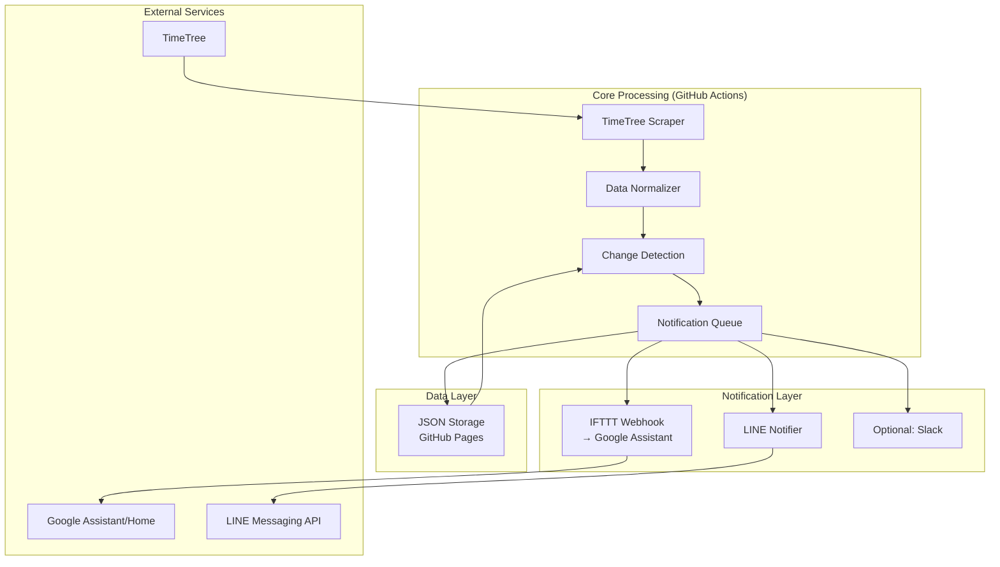

# TimeTree Notifier v3.1 簡素化アーキテクチャ設計

## 🎯 設計原則: KISS (Keep It Simple, Stupid)

v3.0の包括的設計から、実装可能性と保守性を重視した簡素化版を提案。

## 📋 簡素化のポイント

### v3.0 → v3.1 変更点
| 機能 | v3.0 (複雑) | v3.1 (簡素) | 理由 |
|------|-------------|-------------|------|
| **データベース** | SQLite + 複雑同期 | JSON ファイル | 簡単、GitHub Pages対応 |
| **音声通知** | 複数API連携 | IFTTT単一経路 | 実装コスト削減 |
| **実行環境** | GitHub Actions のみ | GitHub Actions + Vercel | 制限回避 |
| **同期方式** | 双方向 | 一方向 (TimeTree→外部) | 複雑性削減 |
| **フォールバック** | 3段階 | 2段階 | 十分な冗長性 |

## 🏗️ 簡素化アーキテクチャ



## 📦 簡素化コンポーネント設計

### 1. Core Data Flow
```python
class SimpleTimeTreeNotifier:
    def __init__(self):
        self.scraper = TimeTreeScraper()
        self.storage = JSONStorage()
        self.notifier = MultiChannelNotifier()
    
    async def daily_sync(self):
        # 1. データ取得 (Primary + 1 Fallback)
        events = await self.scraper.get_events()
        
        # 2. 変更検知 (Simple diff)
        changes = self.storage.detect_changes(events)
        
        # 3. 通知送信 (並列処理)
        await self.notifier.send_notifications(changes)
        
        # 4. データ保存
        self.storage.save_events(events)
```

### 2. JSON Storage (Simple & Fast)
```python
class JSONStorage:
    """GitHub Pages JSONファイルベース"""
    
    def __init__(self, repo_path="data/events.json"):
        self.repo_path = repo_path
    
    def detect_changes(self, new_events: List[Event]) -> EventChanges:
        """前回との差分を簡単比較"""
        previous = self.load_previous_events()
        return simple_diff(previous, new_events)
    
    def save_events(self, events: List[Event]):
        """GitHub Pagesでアクセス可能なJSON保存"""
        with open(self.repo_path, 'w', encoding='utf-8') as f:
            json.dump(events, f, ensure_ascii=False, indent=2)
```

### 3. IFTTT音声通知 (Simplified)
```python
class IFTTTNotifier:
    """IFTTT Webhook経由でGoogle Assistant通知"""
    
    async def send_voice_notification(self, message: str):
        """
        IFTTT Applet設定:
        Trigger: Webhook (event: timetree_daily)
        Action: Google Assistant (Say a phrase)
        """
        webhook_url = f"https://maker.ifttt.com/trigger/timetree_daily/with/key/{self.ifttt_key}"
        payload = {"value1": message}
        await aiohttp.post(webhook_url, json=payload)
```

## ⚙️ 実装計画 (現実的スケジュール)

### Phase 1: 基本機能 (1週間)
- [ ] TimeTreeスクレイピング (既存コード活用)
- [ ] JSON差分検知
- [ ] LINE通知 (既存改良)
- [ ] GitHub Actions設定

### Phase 2: 音声通知 (3-5日)
- [ ] IFTTT Applet設定
- [ ] 音声メッセージフォーマット
- [ ] テスト・デバッグ

### Phase 3: 運用最適化 (3-5日)
- [ ] エラーハンドリング
- [ ] ログ・監視
- [ ] パフォーマンス調整

## 🎯 現実的KPI

| 項目 | 目標 | 測定方法 |
|------|------|----------|
| **開発期間** | 2-3週間 | 実装完了まで |
| **稼働率** | 95%以上 | GitHub Actions成功率 |
| **通知精度** | 99%以上 | 手動検証 |
| **音声通知** | 80%成功 | IFTTT連携成功率 |

## 💡 将来拡張の余地

v3.1で基盤を固めた後、必要に応じて段階的に拡張:

1. **Googleカレンダー連携** (Phase 4)
2. **Slack/Discord拡張** (Phase 5)  
3. **高度な競合解決** (Phase 6)
4. **商用クラウド移行** (Phase 7)

## 📝 まとめ

v3.1は「動くものを早く作る」哲学に基づき：
- **実装可能性**: 既存技術の活用
- **保守性**: シンプルなアーキテクチャ  
- **拡張性**: 段階的機能追加
- **コスト効率**: 無料/低コストサービス活用

この簡素化により、v3.0の理想を段階的に実現可能。