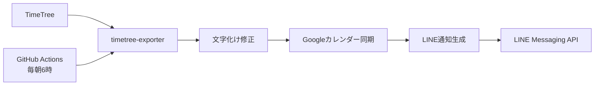

# TimeTree → Googleカレンダー → LINE 簡単同期システム

## 🎯 **システム要件（シンプル版）**

### **必要な機能**
1. ✅ **毎朝6時のLINE通知** - 今日の予定一覧
2. ✅ **TimeTree → Googleカレンダー同期** - 自動同期
3. ✅ **文字化け修正** - 正確な予定認識
4. ✅ **GitHub Actions自動実行** - PC不要

### **不要な機能**
- ❌ 音声通知（Google Assistant）
- ❌ 予定時刻リマインダー
- ❌ 複雑な双方向同期
- ❌ Slack/Discord連携

## 🏗️ **シンプルアーキテクチャ**



## 📦 **コンポーネント設計**

### **1. TimeTree Data Processor（改良）**
```python
class SimpleTimeTreeProcessor:
    """シンプルなTimeTreeデータ処理"""
    
    def __init__(self, config):
        self.exporter = TimeTreeExporter(config)
        self.encoding_fixer = EncodingFixer()  # 文字化け修正
        self.google_sync = GoogleCalendarSync(config)
        self.line_notifier = LINENotifier(config)
    
    async def daily_sync_and_notify(self):
        """毎朝の同期と通知"""
        # 1. TimeTreeからデータ取得
        events = await self.exporter.get_today_events()
        
        # 2. 文字化け修正
        fixed_events = [self.encoding_fixer.fix_event(e) for e in events]
        
        # 3. Googleカレンダーに同期
        await self.google_sync.sync_events(fixed_events)
        
        # 4. LINE通知
        message = self._create_daily_message(fixed_events)
        await self.line_notifier.send_message(message)
```

### **2. 文字化け修正（強化版）**
```python
class EncodingFixer:
    """TimeTreeスクレイピング時の文字化け修正"""
    
    # 実際の文字化けパターンから学習
    GARBLED_MAPPING = {
        # よくある文字化けパターン
        "�A�I�L": "アオキ",
        "����": "買い物", 
        "���X�g": "リスト",
        "�X�g": "スト",
        "�d�b": "電話",
        "���[�e�B���O": "ミーティング",
        # 追加パターンは運用しながら学習
    }
    
    def fix_event(self, event: Event) -> Event:
        """イベントの文字化けを修正"""
        event.title = self._fix_text(event.title)
        event.description = self._fix_text(event.description)
        return event
    
    def _fix_text(self, text: str) -> str:
        """テキストの文字化け修正"""
        if not text or '�' not in text:
            return text
            
        fixed = text
        for garbled, correct in self.GARBLED_MAPPING.items():
            fixed = fixed.replace(garbled, correct)
        
        # パターンマッチしない場合の推測修正
        if '�' in fixed:
            fixed = self._smart_fix(fixed)
            
        return fixed
    
    def _smart_fix(self, text: str) -> str:
        """パターンマッチしない文字化けの推測修正"""
        # 文字列の長さと位置から推測
        # 実装は運用データを見ながら改善
        return text.replace('�', '')  # 暫定的に除去
```

### **3. Googleカレンダー同期（シンプル版）**
```python
class GoogleCalendarSync:
    """一方向同期（TimeTree → Google）"""
    
    def __init__(self, config):
        self.service = self._build_calendar_service(config)
        self.calendar_id = config.google_calendar_id or 'primary'
    
    async def sync_events(self, timetree_events: List[Event]):
        """TimeTreeの予定をGoogleカレンダーに同期"""
        
        # 既存のTimeTree同期予定をクリア
        await self._clear_timetree_events()
        
        # 新しい予定を追加
        for event in timetree_events:
            google_event = self._convert_to_google_event(event)
            await self._insert_event(google_event)
    
    def _convert_to_google_event(self, event: Event) -> dict:
        """TimeTreeイベントをGoogle Calendar形式に変換"""
        google_event = {
            'summary': f"📱 {event.title}",  # TimeTree由来の印
            'description': f"TimeTreeから同期\n\n{event.description}",
            'source': {
                'title': 'TimeTree',
                'url': 'https://timetreeapp.com'
            }
        }
        
        # 時間設定
        if event.is_all_day:
            google_event['start'] = {'date': event.start_time.date().isoformat()}
            google_event['end'] = {'date': event.start_time.date().isoformat()}
        else:
            google_event['start'] = {
                'dateTime': event.start_time.isoformat(),
                'timeZone': 'Asia/Tokyo'
            }
            google_event['end'] = {
                'dateTime': event.end_time.isoformat() if event.end_time else event.start_time.isoformat(),
                'timeZone': 'Asia/Tokyo'
            }
            
        return google_event
    
    async def _clear_timetree_events(self):
        """TimeTree由来の予定をクリア（重複防止）"""
        # 今日の予定を取得
        today = datetime.now().date().isoformat()
        events_result = self.service.events().list(
            calendarId=self.calendar_id,
            timeMin=f"{today}T00:00:00Z",
            timeMax=f"{today}T23:59:59Z",
            q="📱",  # TimeTreeの印で検索
            singleEvents=True
        ).execute()
        
        # TimeTree由来の予定を削除
        for event in events_result.get('items', []):
            if event.get('summary', '').startswith('📱'):
                self.service.events().delete(
                    calendarId=self.calendar_id,
                    eventId=event['id']
                ).execute()
```

### **4. LINE通知（現行システム改良）**
```python
class ImprovedLINENotifier:
    """LINE通知の改良版"""
    
    def create_daily_message(self, events: List[Event]) -> str:
        """読みやすい日次メッセージ作成"""
        
        today = datetime.now().strftime('%m月%d日')
        weekday = ['月', '火', '水', '木', '金', '土', '日'][datetime.now().weekday()]
        
        if not events:
            return f"""おはようございます！

📅 {today}（{weekday}）の予定はありません。

良い一日をお過ごしください！"""

        # 予定をフォーマット
        event_lines = []
        for event in events[:10]:  # 最大10件
            time_str = self._format_time(event)
            event_lines.append(f"▫️ {time_str} {event.title}")
            
        message = f"""おはようございます！

📅 {today}（{weekday}）の予定 {len(events)}件

{chr(10).join(event_lines)}

✅ Googleカレンダーにも同期済みです
今日も一日頑張りましょう！"""

        return message
    
    def _format_time(self, event: Event) -> str:
        """時刻フォーマット（読みやすく）"""
        if event.is_all_day:
            return "終日"
        else:
            start = event.start_time.strftime('%H:%M')
            if event.end_time:
                end = event.end_time.strftime('%H:%M') 
                return f"{start}-{end}"
            return f"{start}〜"
```

## 🚀 **GitHub Actions設定**

### **ワークフロー（簡略版）**
```yaml
name: TimeTree Daily Sync
on:
  schedule:
    - cron: '0 21 * * *'  # 毎朝6時JST
  workflow_dispatch:       # 手動実行

jobs:
  sync-and-notify:
    runs-on: ubuntu-latest
    steps:
      - uses: actions/checkout@v3
      
      - name: Setup Python
        uses: actions/setup-python@v4
        with:
          python-version: '3.11'
          
      - name: Install dependencies
        run: |
          pip install -r requirements.txt
          
      - name: Run TimeTree Sync
        env:
          TIMETREE_EMAIL: ${{ secrets.TIMETREE_EMAIL }}
          TIMETREE_PASSWORD: ${{ secrets.TIMETREE_PASSWORD }}
          LINE_CHANNEL_ACCESS_TOKEN: ${{ secrets.LINE_TOKEN }}
          LINE_USER_ID: ${{ secrets.LINE_USER_ID }}
          GOOGLE_CALENDAR_CREDENTIALS: ${{ secrets.GOOGLE_CREDS }}
        run: |
          python -m timetree_notifier.main --mode daily_sync
```

## ⚙️ **設定ファイル（簡略版）**
```yaml
# config.yaml
timetree:
  email: ${TIMETREE_EMAIL}
  password: ${TIMETREE_PASSWORD}
  calendar_code: "your_calendar_code"

google_calendar:
  calendar_id: "primary"
  credentials_path: "google_creds.json"

line_notification:
  channel_access_token: ${LINE_CHANNEL_ACCESS_TOKEN}
  user_id: ${LINE_USER_ID}
  
daily_sync:
  timezone: "Asia/Tokyo"
  max_events_display: 10
  
encoding:
  fix_garbled_text: true
  learning_mode: true  # 新しい文字化けパターンを記録
```

## 📋 **実装手順（2週間）**

### **Week 1: 基本機能**
- Day 1-2: 文字化け修正機能実装
- Day 3-4: Googleカレンダー同期機能
- Day 5-6: LINE通知改良
- Day 7: 統合テスト

### **Week 2: 自動化と運用**
- Day 8-9: GitHub Actions設定
- Day 10-11: エラーハンドリング強化
- Day 12-13: 本番テスト
- Day 14: 運用開始

## 🎯 **成功基準**

1. **予定認識精度**: 文字化け修正後100%正確
2. **同期成功率**: Googleカレンダー同期95%以上
3. **通知成功率**: LINE通知95%以上  
4. **自動実行**: GitHub Actionsで毎朝確実に動作

この設計で、シンプルかつ確実なTimeTree連携システムが構築できます。